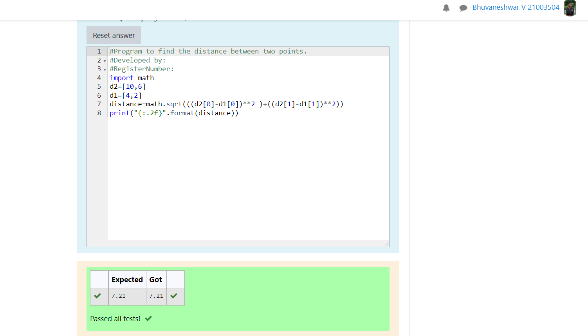

# DISTANCE-BETWEEN-TWO-POINTS

## AIM:
To write a python program to find the distance two 2 points
## ALGORITHM:
### Step 1: 
Commence the program
### Step 2: 
Get the value from the user for the number of rotation
### Step 3: 
Substitute the values in the distance formula  
### Step 4:
use the distance formula to calculate the values  
### Step 5: 
End the program
### PROGRAM:
~~~
import math 
d2=[10,6]
d1=[4,2]
distance=math.sqrt(((d2[0]-d1[0])**2 )+((d2[1]-d1[1])**2))
print("{:.2f}".format(distance))
~~~
### OUTPUT:

### RESULT:
Thus the distance of the  are successfully executed
